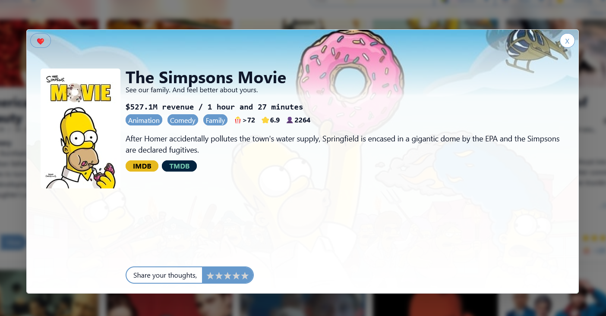

# Movie Browser 🎬

Web III assignment 1 project



## Features💡
- Dynamically updating query parameters for easy search / filter sharing
- Change Theme color

## Development Deployment 🚧

Clone the project

```bash
  git clone https://github.com/Exsius/webIIIa1
```

Go to the project directory

```bash
  cd webIIIa1
```

Start the server using docker compose

```bash
  docker-compose up
```

## Tech used🔧

- [React](https://github.com/facebook/react) Javascript Framework from Meta
- [Tailwind](https://tailwindcss.com/) CSS Framework
- [Docker](https://www.docker.com/) Deployment Tool

## Authors 🎓

- [@Exsius](https://www.github.com/exsius)

